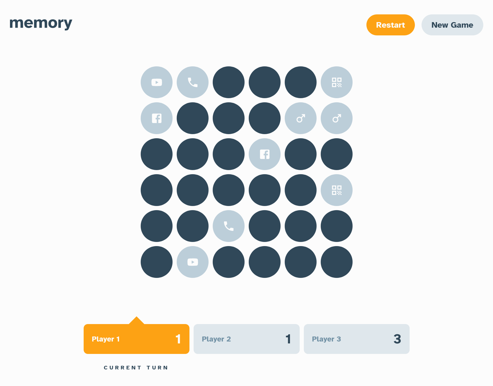

# Frontend Mentor - Memory game solution

This is a solution to the [Memory game challenge on Frontend Mentor](https://www.frontendmentor.io/challenges/memory-game-vse4WFPvM). Frontend Mentor challenges help you improve your coding skills by building realistic projects.

## Table of contents

- [Overview](#overview)
  - [The challenge](#the-challenge)
  - [Screenshot](#screenshot)
  - [Links](#links)
- [My process](#my-process)
  - [Built with](#built-with)
  - [What I learned](#what-i-learned)
  - [Continued development](#continued-development)
  - [Useful resources](#useful-resources)
- [Author](#author)
- [Acknowledgments](#acknowledgments)

## Overview

### The challenge

Users should be able to:

- View the optimal layout for the game depending on their device's screen size
- See hover states for all interactive elements on the page
- Play the Memory game either solo or multiplayer (up to 4 players)
- Set the theme to use numbers or icons within the tiles
- Choose to play on either a 6x6 or 4x4 grid

### Screenshot

### Links

- Solution URL: [Solution](https://www.frontendmentor.io/solutions/responsive-memory-game-using-reactmaterial-uitypescript-LWR-GkzH7H)
- Live Site URL: [App](https://webguy83.github.io/memory-game/)

## My process

### Built with

- [React](https://reactjs.org/) - JS library
- [MUI](https://mui.com/) - React framework
- [TypeScript](https://www.typescriptlang.org/) - For coding

### What I learned

Working with Grid components in MUI saves a lot of time!

### Continued development

Looking to refine best practices when it comes to theming components in MUI and properly configuring them.

### Useful resources

- [Mui Grid](https://mui.com/material-ui/react-grid/) - Very handy to use when you want to put components in a grid easily without having to deal with CSS Grid, etc.
- [MUI Toggle Buttons](https://mui.com/material-ui/react-toggle-button/#main-content) - Incredibily useful components when you want to toggle state on buttons.

## Author

- Frontend Mentor - [@webguy83](https://www.frontendmentor.io/profile/webguy83)
- Instagram - [@canadianwebdev83](https://www.instagram.com/canadianwebdev83/)
- Github - [@webguy83](https://www.github.com/webguy83/)

## Acknowledgments

Thanks to friends and family for being amazing.
